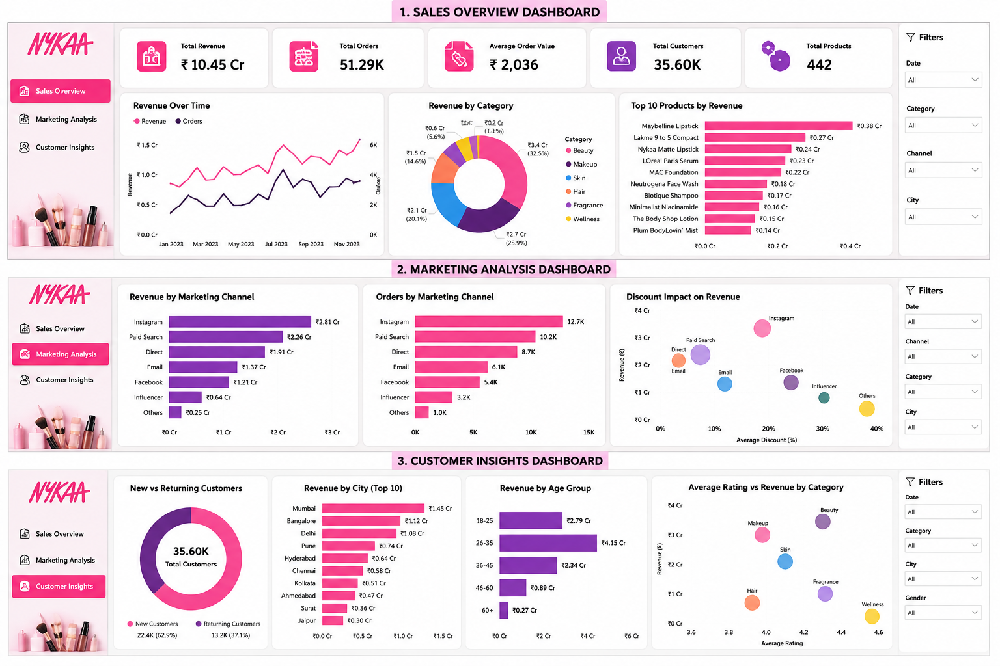

  

<h1 align="center">Nykaa Customer & Marketing Analytics 📊</h1>

Data Analyst Portfolio Project | SQL • Excel • Power BI • Business Analytics

---

## 📌 Project Overview

This project focuses on analyzing Nykaa-style e-commerce data to understand customer behavior, marketing performance, sales trends, and business growth opportunities.

The objective is to transform raw business data into meaningful insights and recommendations using data analytics techniques.

---

# 🎯 Business Problem

Nykaa wants to improve growth and customer retention by understanding:

- Which products generate the highest revenue?
- Which marketing channels bring valuable customers?
- What customer segments contribute most to sales?
- Are discounts increasing sales effectively?
- How can customer repeat purchases be improved?

---

# 🛠 Tools & Technologies

| Tool | Purpose |
|---|---|
| Excel | Data cleaning & preparation |
| SQL | Data analysis & business queries |
| Power BI | Dashboard creation & visualization |
| GitHub Projects | Project tracking & workflow |

---

# 📂 Dataset Description

The dataset contains e-commerce transaction details including:

- Order information
- Customer details
- Product categories
- Revenue data
- Marketing channels
- Discounts
- Ratings
- Customer purchase behavior

---

# 🔄 Project Workflow

## 1. Data Preparation

Performed:

- Data cleaning
- Missing value checks
- Data formatting
- Column validation
- Feature preparation

---

## 2. SQL Analysis

Business analysis performed:

### Sales Analysis
- Total revenue calculation
- Order performance
- Average order value
- Category-wise sales

### Marketing Analysis
- Revenue by marketing channel
- Customer acquisition performance
- Discount impact analysis

### Customer Analysis
- New vs returning customers
- Customer value analysis
- Purchase behavior

---

# 📊 Power BI Dashboard

Dashboard sections:

## Sales Overview

Includes:

- Total Revenue
- Total Orders
- Average Order Value
- Monthly Sales Trends
- Category Performance
- ## Dashboard Preview

### Sales Dashboard

### Marketing Dashboard

### Customer Dashboard

---

## Marketing Performance

Includes:

- Revenue by Channel
- Customer Acquisition
- Discount Effectiveness

---

## Customer Insights

Includes:

- New vs Returning Customers
- City-wise Revenue
- Customer Behavior Analysis

---

# 📁 Project Structure

Nykaa-Customer-Marketing-Analytics
│
├── Data
│ └── nykaa_sales_data.xlsx
│
├── SQL
│ └── analysis_queries.sql
│
├── PowerBI
│ └── nykaa_dashboard.pbix
│
├── Images
│ └── nykaa_logo.png
│
└── README.md
---

# 💡 Key Insights

The analysis helps identify:

- High-performing product categories
- Most effective marketing channels
- Customer segments with higher value
- Opportunities for improving retention

---

# 🚀 Future Improvements

Future enhancements:

- Add larger real-world dataset
- Build customer segmentation model
- Add predictive sales forecasting
- Automate business reporting
- Create advanced Power BI metrics

# 📌 Project Management

Managed using GitHub Projects:

Workflow:

Backlog → In Progress → Review → Done

# 👩‍💻 Author

**Shirin Kaleher**

Data Analytics | Business Intelligence | Technology

